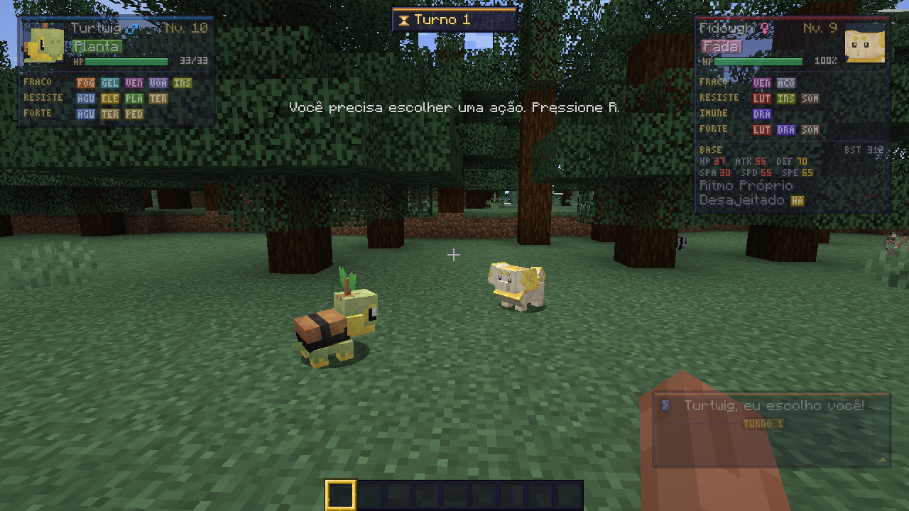
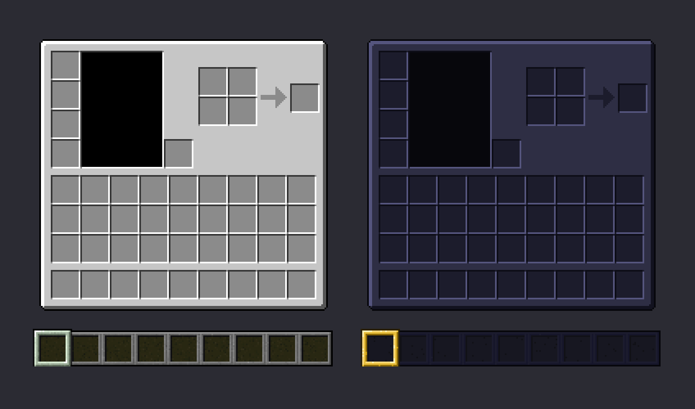
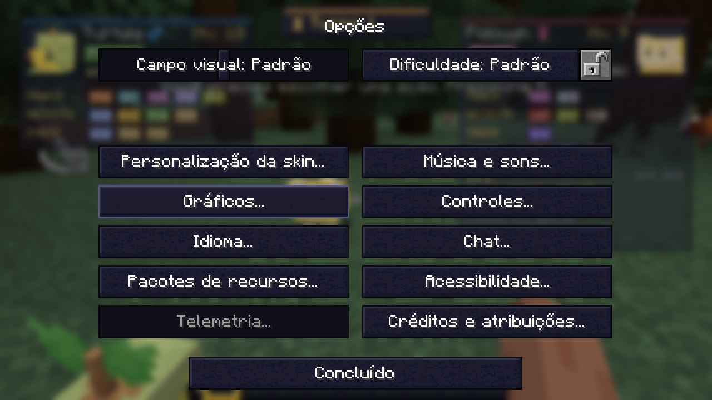

# ShifuMon

Mod **client-side** para **Minecraft 1.21.1 + Fabric + Cobblemon 1.8.x**, escrito em Kotlin.
Adiciona informações extras, melhorias visuais e uma interface customizável. Toda a arte é
**pixel art** no estilo Minecraft / Pokémon GBA.

Funciona em qualquer servidor: o mod não precisa estar no servidor e só usa dados que o próprio
Cobblemon já envia para o seu cliente.



| Pacote Retro: inventário e hotbar (antes → depois) | Pacote Retro: botões |
|---|---|
|  |  |

## Instalação

1. Baixe o `shifumon-<versão>.jar` em [Releases](https://github.com/bigaodospoke/ShifuMon/releases).
2. Coloque na pasta `mods` da sua instância (Fabric + Cobblemon 1.8).
3. Configure na tecla **O** (ou pelo Mod Menu).
4. Opcional: ative o visual escuro em **Opções → Pacotes de Recursos → "ShifuMon Retro"**.

## Requisitos

| Item | Versão |
|---|---|
| Minecraft | 1.21.1 |
| Fabric Loader | ≥ 0.17.2 |
| Fabric API | ≥ 0.116.6+1.21.1 |
| Cobblemon | ≥ 1.8.0 (desenvolvido contra 1.8.1) |
| Fabric Language Kotlin | já vem embutido no Cobblemon |
| Mod Menu | opcional (botão "Configurar") |
| JDK (para compilar) | 21 |

## Compilar e rodar

```bash
./gradlew build        # gera build/libs/shifumon-<versão>.jar
./gradlew runClient    # abre o jogo em ambiente de dev (Cobblemon + Mod Menu inclusos)
```

No Windows use `gradlew.bat`. O `JAVA_HOME` precisa apontar para um **JDK 21**.

## Funcionalidades

| # | Recurso | Estado |
|---|---|---|
| 1 | **Ícone shiny customizado** — Estrela, Quadrado, Diamante, Coroa, Padrão ou PNG próprio | ✅ Summary, PC e Trade |
| 2 | **Info do Pokémon na mira** — nível, shiny, sexo, tipos, nature (+/− stat), habilidade (marca HA), hab. oculta da espécie, tamanho, altura, peso, forma | ✅ |
| 3 | **Bloco de batalha substituto** — no lugar do bloco de HP do Cobblemon (mantém retrato animado e animação): HP estilo Gen 3, tipos, status, boosts, fraquezas (×2/×4), resistências, imunidades e contra quais tipos o Pokémon é forte | ✅ |
| 3 | **Oponente** — stats base, BST e habilidades possíveis logo abaixo da vida dele | ✅ |
| 4 | **Botões de golpe redesenhados** — tipo, categoria, PP e eficácia contra o alvo (X2 SUPER, X1/2, IMUNE), continuando clicáveis | ✅ |
| 4 | **Histórico de batalha estilizado** — divisória por turno, barra na cor do tipo do golpe, etiquetas de crítico/eficácia/desmaio/troca/boost/status/clima | ✅ |
| 4 | **Battle HUD** — turno, clima, terreno e efeitos de campo, com ícones | ✅ |
| 2 | **Chance de captura** — com uma Poké Bola na mão, estimativa pela fórmula do Cobblemon (bola, nível, taxa da espécie); faixa entre HP cheio e 1 HP + sono, porque o servidor não envia HP/status de selvagens | ✅ |
| 5 | **Busca avançada no PC** — estende o filtro nativo do Cobblemon + painel de resultados por caixa (clique para abrir) | ✅ |
| 5 | **Slots do PC** — ícone de shiny e bolinha de IVs: dourada (seis máximos), azul (quase perfeito, limite configurável) e roxa (todos zerados) | ✅ |
| 7 | **Pacote de texturas "ShifuMon Retro"** — HUD, inventário, widgets e botões de batalha do Cobblemon repintados em memória a partir das texturas originais instaladas (nenhuma textura de terceiros vem no jar); opcional, em Opções > Pacotes de Recursos | ✅ |
| 7 | **Respeita pacotes de textura** — se um pacote (ex.: barra de HP personalizada) retexturiza o bloco de HP, o histórico ou os botões de golpe, a textura do pacote é mantida; desativável na aba Interface | ✅ |
| 6 | **Configuração** — tela própria (Mod Menu ou tecla `O`) e editor visual de HUD com arrastar e soltar | ✅ |

### Sintaxe da busca no PC

Digite no campo de filtro do próprio PC do Cobblemon. Sem acento, sem diferença de maiúsculas;
`!` na frente nega o termo. O que não for reconhecido continua indo para a busca nativa.

```
nature:adamant   natureza:firme     hab:static        tipo:fogo
nome:pika        sexo:f             lv:50  lv:>30  lv:10-20
shiny            ha                 !shiny
```

### Ícone shiny customizado

Coloque um PNG em `config/shifumon/custom_shiny.png` (16×16 recomendado, fundo transparente),
escolha o estilo **Customizado** e clique em **Recarregar ícone**.

### Limitação importante (client-side)

O servidor do Cobblemon **não envia** nature nem habilidade de Pokémon que não são seus.
Para Pokémon selvagens ou de outros jogadores o painel mostra `???` nesses campos. Tudo que é
público (espécie, forma, tipos, sexo, shiny, nível, tamanho, habilidade oculta *possível*) aparece
normalmente. Nos seus Pokémon (party e PC) tudo é exibido.

## Estrutura

```
ShifuMon/
├── build.gradle.kts, settings.gradle.kts, gradle.properties
├── tools/
│   └── PixelArtGenerator.java      # desenha os sprites do mod a partir de grades ASCII
└── src/main/
    ├── java/com/shifumon/mixin/minecraft/
    │   └── PackRepositoryMixin.java        # adiciona o pacote Retro à lista de pacotes do cliente
    ├── java/com/shifumon/mixin/cobblemon/
    │   ├── GuiUtilsMixin.java              # troca o ícone shiny em todo blitk do Cobblemon
    │   ├── BattleMessageHandlerMixin.java  # lê turno/clima/terreno/boosts das mensagens de batalha
    │   ├── BattleOverlayMixin.java         # desenha o bloco de batalha do ShifuMon (+ Invoker)
    │   ├── MoveTileMixin.java              # botões de golpe com eficácia
    │   ├── BattleMessagePaneMixin.java     # histórico de batalha estilizado (+ Invoker)
    │   ├── StorageSlotMixin.java           # ícone shiny e bolinha de IVs nos slots do PC
    │   └── SearchCompanionMixin.java       # adiciona filtros avançados ao Search.of do PC
    ├── kotlin/com/shifumon/
    │   ├── ShifuMon.kt / ShifuMonClient.kt # constantes e entrypoint
    │   ├── config/                         # modelo, JSON, âncoras da HUD
    │   │   └── gui/                        # tela de config + editor de HUD
    │   ├── shiny/                          # estilos e resolução de textura do shiny
    │   ├── pokemoninfo/                    # raycast, resolver de dados, painel de info
    │   ├── capture/                        # estimativa da chance de captura
    │   ├── battle/                         # leitura da batalha, boosts, painéis, tabela de tipos
    │   │   ├── tile/                       # bloco de batalha substituto (CobblemonPortrait.kt: MPL-2.0)
    │   │   ├── move/                       # botões de golpe
    │   │   └── log/                        # histórico de batalha
    │   ├── boxsearch/                      # parser da busca, integração e painel no PC
    │   ├── pc/                             # marcações nos slots do PC
    │   ├── hud/                            # HudElement, HudManager, dados de preview
    │   │   ├── panel/                      # DSL de painéis (linhas, textos, badges, barras)
    │   │   └── render/                     # primitivas pixel art, fonte 3x5, paleta, ícones
    │   ├── resource/                       # pacote Retro gerado em memória
    │   ├── keybind/                        # atalhos de teclado
    │   ├── compat/modmenu/                 # integração opcional com Mod Menu
    │   └── util/                           # FeatureGuard, detecção de pacotes de textura, texto, cores
    └── resources/
        ├── fabric.mod.json, shifumon.mixins.json
        ├── assets/shifumon/
        │   ├── icon.png
        │   ├── lang/ (pt_br, en_us)
        │   └── textures/gui/{shiny,hud}/   # sprites 16x16 e 9x9
```

## Arquitetura

- **Módulos independentes.** Cada pacote registra os próprios eventos em `ShifuMonClient`.
  Nenhum módulo conhece a tela de config; todos leem `ConfigManager.config`.
- **HUD declarativa.** Um `HudElement` só descreve o conteúdo com a DSL `panel { row { … } }`.
  O `HudManager` cuida de posição (âncora + deslocamento), visibilidade e erros, e o editor de
  HUD reutiliza o mesmo `build(preview = true)` com dados de exemplo.
- **Modelos de exibição.** Os painéis de batalha consomem `BattleInfoView`/`BattlePokemonView`;
  só `BattleReader` toca nas classes de batalha do Cobblemon.
- **Compatibilidade com updates do Cobblemon.**
  - Mixins pequenos, em classes client-side do Cobblemon (e um no repositório de pacotes do
    Minecraft, para o pacote Retro), com `required: false` e
    `defaultRequire: 0`: se um alvo mudar, o jogo abre e só aquele recurso some. As substituições
    visuais (bloco de HP, botões de golpe, histórico) podem ser desligadas na config e devolvem o
    desenho original do Cobblemon.
  - `FeatureGuard` envolve todo acesso ao Cobblemon: um `NoSuchMethodError` desliga apenas o
    recurso afetado, com um único log.
  - Clima/terreno/turno vêm de **chaves de tradução** das mensagens do servidor, não de texto.
  - A busca do PC **estende** o filtro nativo em vez de substituí-lo.
- **Config versionada.** `configVersion` + `migrate()`, valores padrão em todos os campos,
  backup automático (`.broken`) se o JSON estiver corrompido.

### Por que não Architectury / GeckoLib?

O mod é só client-side e só Fabric, e o Cobblemon Fabric não exige Architectury API em runtime.
Adicionar Architectury agora só aumentaria o build. Se um port para NeoForge virar objetivo, a
separação em pacotes já facilita mover a lógica para um módulo `common`. GeckoLib não é necessário:
nenhum recurso usa modelos animados.

## Pixel art

Todos os sprites do mod saem de `tools/PixelArtGenerator.java`:

```bash
java tools/PixelArtGenerator.java
```

As grades usam `#` para corpo com contorno/luz/sombra automáticos (estilo GBA) e letras para
cores explícitas. Os PNGs gerados podem ser editados à mão ou sobrescritos por resource pack
(`assets/shifumon/textures/gui/...`). A interface é desenhada com retângulos em coordenadas
inteiras e uma fonte pixel 3×5 própria, para ficar nítida em qualquer escala de GUI.

O pacote **ShifuMon Retro** não guarda texturas: `RetroTheme` lê as texturas originais do
Minecraft e do Cobblemon instalados e troca só as cores (cinzas viram a paleta escura do mod;
cores vivas como corações e comida são mantidas). Nada é gravado em disco.

## Próximos passos sugeridos

- Tooltip de info ao passar o mouse nos slots do PC e da party.
- Imunidades por habilidade (Levitate, Flash Fire…) no cálculo de eficácia.
- Controle deslizante de escala da HUD (múltiplos inteiros, para manter o pixel art).

## Licença

Código sob a licença [MIT](LICENSE), exceto `CobblemonPortrait.kt`, adaptado do Cobblemon e
distribuído sob a [MPL-2.0](https://mozilla.org/MPL/2.0/).

## Créditos e avisos

- Feito para o [Cobblemon](https://cobblemon.com) (Cobblemon Contributors). O retrato do bloco
  de batalha é adaptado do código do Cobblemon, e a chance de captura reproduz a fórmula da
  `CobblemonCaptureCalculator`.
- Projeto de fã, sem vínculo com Cobblemon, Mojang Studios, Microsoft, Nintendo, Game Freak ou
  The Pokémon Company. Pokémon é marca registrada de seus respectivos donos.
